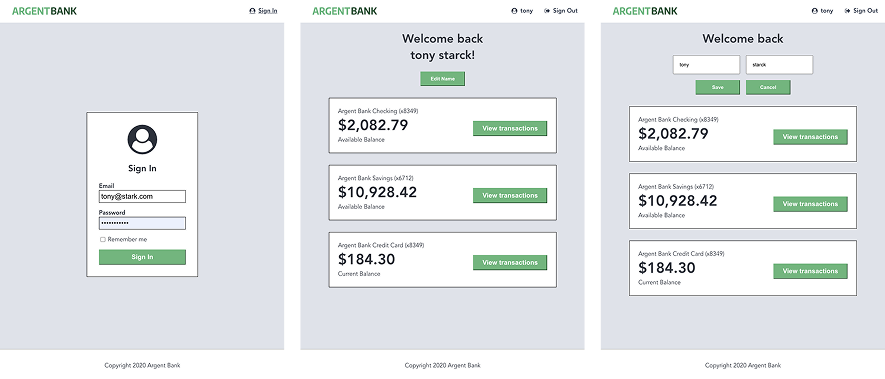

<br />
<br />
[](https://vitejs.dev)
[](https://react.dev)
[](https://redux-toolkit.js.org)
[](https://reactrouter.com)
<br />

As it stands, ArgentBank is an online banking application with a functional backend that processes data and exposes three routes. One for authentication, one for retrieving the profile after login, and the last for updating the username. The frontend remains to be developed, which is precisely the purpose of this mission.

**Mission-Phase 1:** Build a React web app powered by Redux for authentication and profile editing features with data persistence.
<br />**Mission-Phase 2:** Prepare future routes for upcoming transaction features using the Swagger Editor tool and provide them in a YAML file.

 [see the backend](https://github.com/OpenClassrooms-Student-Center/Project-10-Bank-API/tree/master)
<br />  [see the documentation]()
<br />  [see the issues of mission](https://github.com/OpenClassrooms-Student-Center/Project-10-Bank-API/tree/master/.github/ISSUE_TEMPLATE)



<br /> 

 **Clone the ARGENTBANK project**

```bash
git init
git clone https://github.com/JulienLOG/argentBank.git
npm install
```
<br />

 **Preview of routes**
```bash
POST /api/v1/user/login
Headers: Content-Type: application/json
Body: { "email": "user@mail.com", "password": "*****" }
→ 200: { "body": { "token": "jwt..." } }
```

```bash
POST /api/v1/user/profile
Headers: Authorization: Bearer <token>
→ 200: { "body": { "id": "...", "email": "...", "firstName": "...", "lastName": "..." } }
```

```bash
PUT /api/v1/user/profile
Headers: Authorization: Bearer <token>, Content-Type: application/json
Body: { "firstName": "Steve", "lastName": "Rogers" }
→ 200: { "body": { "id": "...", "email": "...", "firstName": "Steve", "lastName": "Rogers" } }
```
